# Online Examination System

An Online Examination System built with PHP and MySQL, designed to provide a seamless and efficient platform for conducting online tests and assessments. The system supports user registration, login, profile management, exam participation, and an admin panel for managing users and questions.

## Features

- User registration and authentication
- User profile management
- Take online exams and view results
- Admin panel for managing users and exam questions
- Responsive UI using Bootstrap
- Session management and security features

## Technologies Used

- Frontend: HTML,CSS,JavaScript  
- Backend:PHP  
- DataBase: MySQL

## Project Structure

```
.
├── admin/                  # Admin panel files
│   ├── css/
│   ├── img/
│   ├── inc/
│   ├── index.php
│   ├── login.php
│   ├── quesadd.php
│   ├── queslist.php
│   └── users.php
├── classes/                # Core PHP classes (User, Exam, Admin, Process)
├── config/                 # Configuration files
├── css/                    # Custom CSS
├── helpers/                # Helper classes (Format.php)
├── img/                    # Images
├── inc/                    # Common includes (header, footer)
├── lib/                    # Library files (Database, Session)
├── vendor/                 # Third-party libraries (Bootstrap, jQuery)
├── dashboard.php
├── exam.php
├── final.php
├── getlogin.php
├── getregister.php
├── index.php
├── profile.php
├── register.php
├── starttest.php
├── test.php
├── viewans.php
└── .vscode/                # VS Code settings
```

## ScreenShots

### Login Page
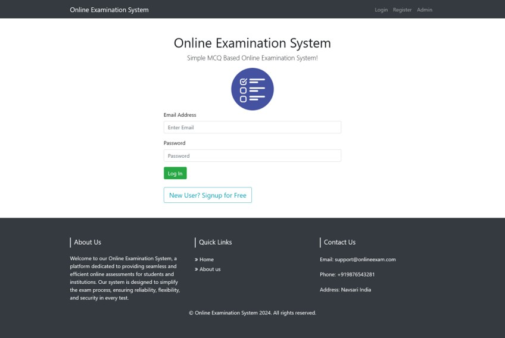

### Register Page
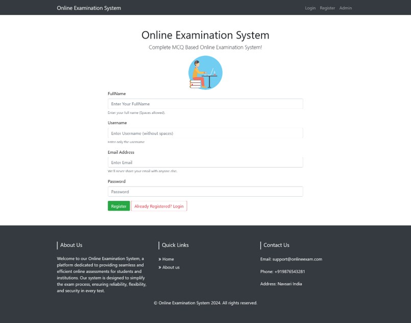

### Home Page
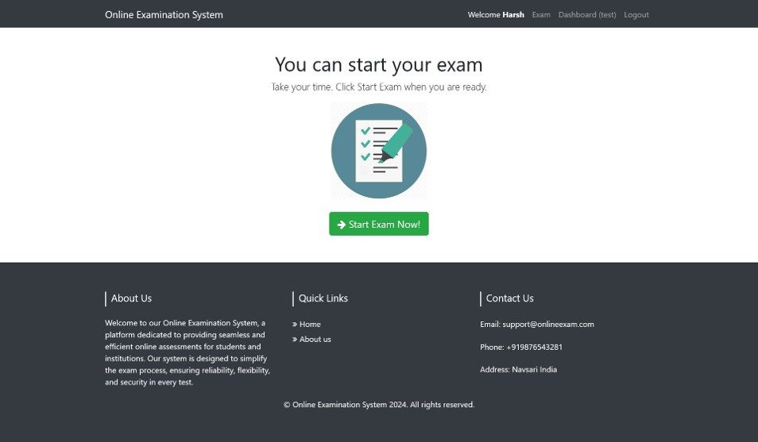

### Student Dashboard


### Exam Page
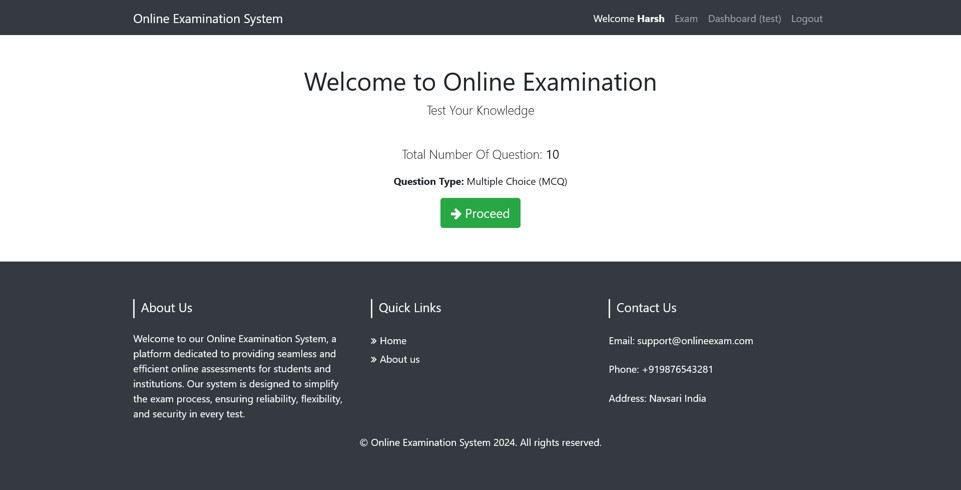

### Test Page
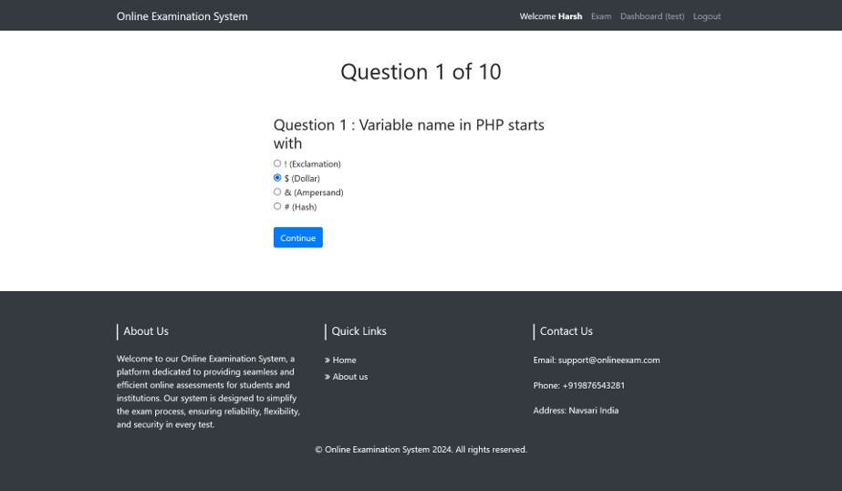

### Result Page
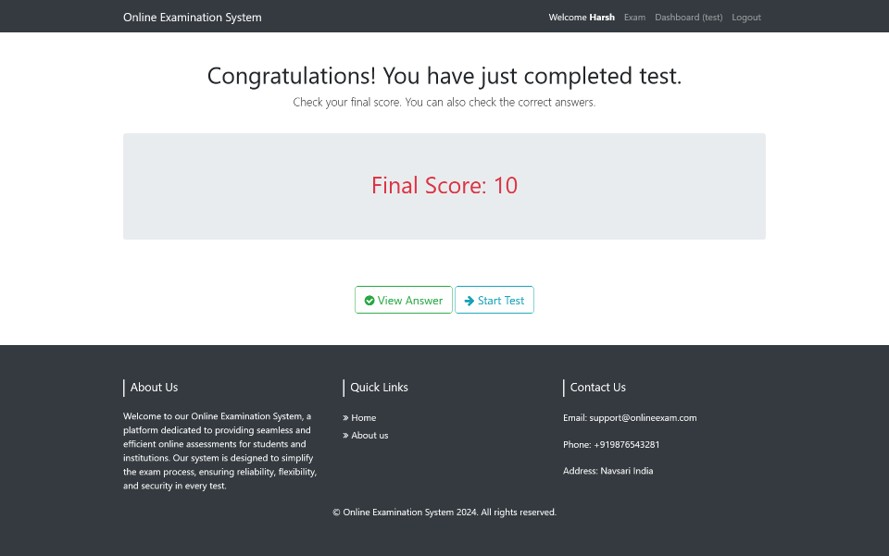

### View Answer Page
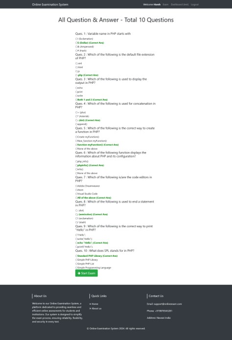

### Admin Login
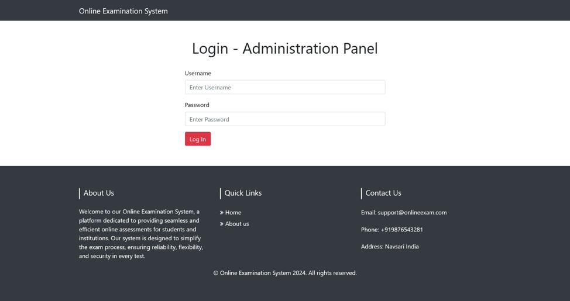

### Admin Dashboard
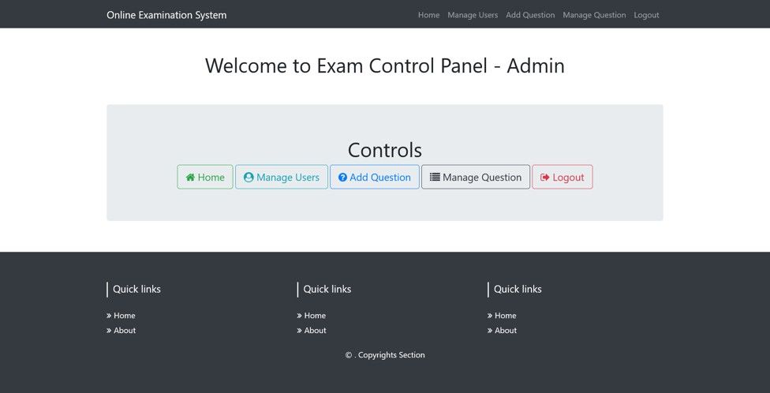

### Manage User
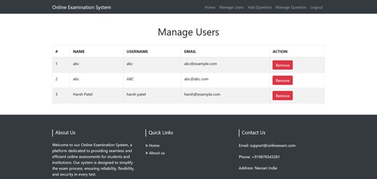

### Add Questions
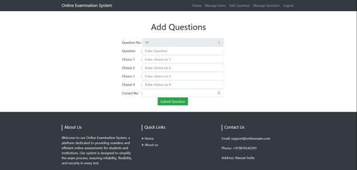

### Manage Questions
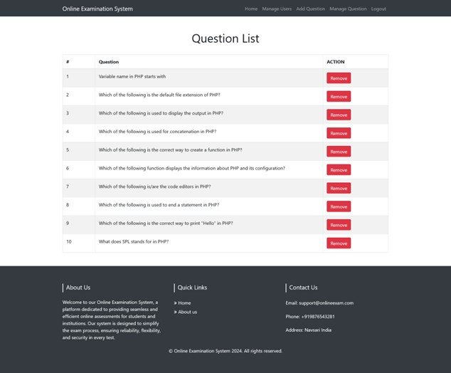


## Usage

- User:Register, log in, take exams, and view results.
- Admin:Log in to the admin panel to manage users and exam questions.

## Future Enhancement 
- Subject Wise Examination
- Proper Report Generation
- Time limit and Auto Submit Feature
- Proper Student Dashboard
- Exam Scheduling
- Enhanced Security


**Note:** For any issues or contributions, please open an issue or submit a pull request on [GitHub](https://github.com/Golu-1312/online-examination-php).